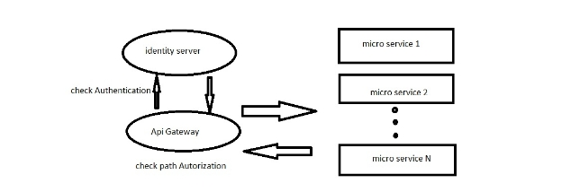
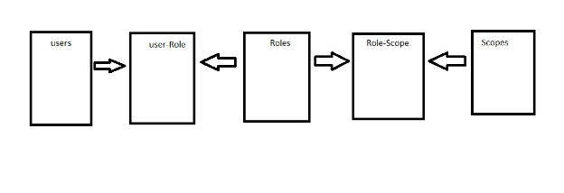

Spring boot Micro Service Architecture

This project consist of 3 major sub projects 

1) Order project consist 4 simple spring boot API s for test the project
1) Security Project used from spring Security for user Authentication and Authorization with inspiration from: https://www.bezkoder.com/spring-boot-jwt-authentication/
1) Api Gateway project that first of all send requests to Security project for validating users after that send request to service project if user authorized.

This project consist swagger with inspiration from

<https://medium.com/@oguz.topal/central-swagger-in-spring-cloud-gateway-697a1c37b03d>

You can see swagger from 

<http://localhost:8080/webjars/swagger-ui/index.html>

security project Used from spring security with postgresql database and JPA

Difference of this implementation from other implementation I saw before are 2 things

1. Authorization implemented in Micro service architecture. It means if a user Authenticate maybe it restricted from a specific service and it checked in api Gateway.  
1. Every and each user has many types of authorizations it means each user could have many roles and each role could have many scopes and Authorizations checked with scopes

